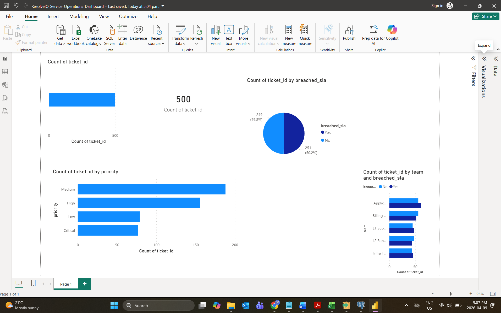

ResolveIQ – Service Operations Analytics Dashboard
Overview
This project analyzes IT service ticket data to identify SLA breaches, workload distribution, and operational inefficiencies using SQL, PostgreSQL, and Power BI.

Dataset
- 500+ service tickets
- Features:
  - Priority (Low, Medium, High, Critical)
  - SLA hours vs Resolution hours
  - Breach status
  - Team and agent assignment
  - Channel and region
  - CSAT score

Tools Used
- SQL
- PostgreSQL
- Power BI
- Excel

Key Insights
- ~50% of tickets breached SLA
- Medium and High priority tickets dominate workload
- Certain teams show higher SLA breach concentration
- Opportunity for workload balancing and SLA optimization

Dashboard Features
- KPI: Total Tickets
- SLA Breach Distribution
- Priority-wise Ticket Analysis
- Team vs SLA Breach Comparison

Dashboard Preview

